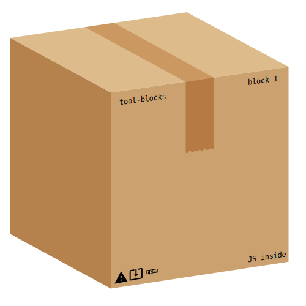

# tool-blocks

The toolbox made of blocks

Click to expand

- [tool-blocks](#tool-blocks)
  - [Why this project](#why-this-project)
  - [Install](#install)
  - [Dev](#dev)
  - [License](#license)

## Why this project

- easy electron integration
- use javascript easily
- data in your computer and not internet
- support many JS framework

## Install

You just need to install the project and start adding some blocks !

## Dev

You can start by looking at the wiki to understand the main program

The rest of the program is your work !

## License

TODO : tochoose
