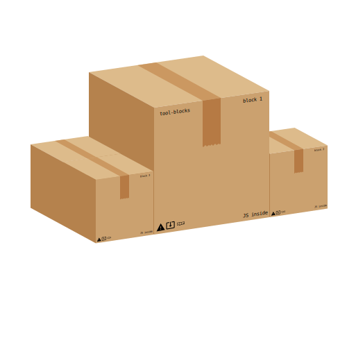

# tool-blocks

The toolbox made of blocks

## Why this project

- easy electron integration
- use javascript easily
- data in your computer and not internet
- support many JS framework

## How to use

You just need to install the project and start adding some blocks !

## How to dev a block

You can start by looking at the wiki to understand the main program

The rest of the program is your work !

## License

TODO : tochoose